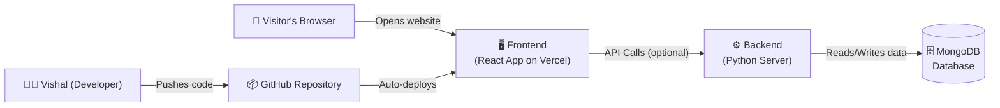

# Vishal QA Portfolio — Stakeholder Report

## 🧭 What Is This Project?

This is a **personal portfolio website** for Vishal — a QA (Quality Assurance) professional. Think of it like a digital resume and showcase, accessible to anyone via the internet. Visitors can learn about Vishal's skills, projects, achievements, published articles, and can even contact him directly through the site.

🌐 **Live URL**: [vishal-qa-portfolio.vercel.app](https://vishal-qa-portfolio.vercel.app)

---

## 🏗️ Architecture — How Is It Built?

The project has two parts: a **Frontend** (what users see) and a **Backend** (server-side logic). Think of it like a restaurant — the frontend is the dining area customers interact with, and the backend is the kitchen.



| Layer | Role | Simple Analogy |
|---|---|---|
| **Frontend** | The website visitors see and interact with | The shop window & interior |
| **Backend** | Handles server-side tasks (e.g. status checks) | The back office |
| **Database** | Stores data (e.g. contact logs) | The filing cabinet |
| **GitHub** | Stores all the code, tracks every change | The version-controlled blueprint archive |
| **Vercel** | Hosts and serves the website to the world | The landlord/web host |

---

## 💻 Technologies Used

### Frontend (What You See)

| Technology | What It Does | Layman Explanation |
|---|---|---|
| **React** | Builds the user interface | The engine that powers every button, section, and animation on the page |
| **Tailwind CSS** | Styles the page | The design toolkit — colours, fonts, spacing |
| **React Router** | Handles navigation | Makes sure clicking links takes you to the right section |
| **CRACO** | Customises the build process | Fine-tunes how the app is packaged before going live |
| **Recharts** | Displays charts/graphs | For visualising data (e.g. skill levels) |
| **Radix UI** | Pre-built accessible components | A library of polished UI building blocks (menus, dialogs, etc.) |
| **React Hook Form + Zod** | Form handling & validation | Powers the Contact form and checks inputs are valid |
| **Axios** | Makes API network calls | The messenger between the frontend and backend |

### Backend (Behind the Scenes)

| Technology | What It Does | Layman Explanation |
|---|---|---|
| **Python + FastAPI** | Powers the backend server | A fast, modern web server written in Python |
| **MongoDB** | Stores data | A flexible database — like a collection of digital filing drawers |
| **Motor** | Python driver for MongoDB | Lets the Python server talk to MongoDB |

### DevOps & Deployment

| Technology | What It Does |
|---|---|
| **GitHub** | Source code repository — every change is tracked here |
| **Vercel** | Automatically deploys the frontend whenever code is pushed to GitHub |
| **GitHub Actions** | CI/CD pipeline — also available for automated build & test on every push |

---

## 📁 Folder Structure — What Lives Where

```
vishal-qa-portfolio/              ← Root of the project
│
├── frontend/                     ← Everything the visitor sees
│   ├── src/
│   │   ├── pages/
│   │   │   └── Portfolio.js      ← The single main page (assembles all sections)
│   │   ├── components/           ← Individual sections of the website
│   │   │   ├── Header.js         ← Top navigation bar
│   │   │   ├── Hero.js           ← The big intro banner/headline
│   │   │   ├── About.js          ← About Vishal section
│   │   │   ├── Skills.js         ← Skills & expertise section
│   │   │   ├── Achievements.js   ← Awards & milestones
│   │   │   ├── Projects.js       ← Portfolio of projects
│   │   │   ├── Articles.js       ← Published articles/blogs
│   │   │   ├── GitHub.js         ← GitHub activity showcase
│   │   │   ├── Contact.js        ← Contact form
│   │   │   ├── Footer.js         ← Bottom footer
│   │   │   └── ui/               ← Reusable UI building blocks (buttons, cards, etc.)
│   │   ├── contexts/             ← App-wide settings (e.g. dark/light mode)
│   │   ├── hooks/                ← Custom reusable logic
│   │   └── lib/                  ← Shared utility helper functions
│   ├── public/                   ← Static files (favicon, HTML template)
│   ├── package.json              ← List of all dependencies & build scripts
│   └── craco.config.js           ← Build customisation config
│
├── backend/                      ← Server-side logic
│   ├── server.py                 ← Main Python API server (FastAPI)
│   └── requirements.txt          ← Python dependencies list
│
├── docs/                         ← Project documentation
│   └── stakeholder_report.md     ← This file
│
├── .github/workflows/
│   └── deploy.yml                ← Automated CI/CD pipeline (GitHub Actions)
│
└── tests/                        ← Automated tests
```

---

## 🔄 How Deployment Works

The deployment process is **fully automated** — Vishal just pushes code to GitHub, and the rest happens automatically.

```
1. Vishal writes/updates code on his laptop
       ↓
2. He pushes the changes to GitHub (version control)
       ↓
3. Vercel detects the new push automatically
       ↓
4. Vercel builds the app (runs `yarn build` inside the `frontend/` folder)
       ↓
5. Vercel publishes the new version live at vishal-qa-portfolio.vercel.app
       ↓
6. The entire process takes ~1–2 minutes
```

> **Tip**: This means **zero manual effort** is needed to update the live website. Every code change Vishal makes is automatically reflected on the public site within minutes.

---

## 🌟 Key Highlights for Stakeholders

- ✅ **Live & publicly accessible** at [vishal-qa-portfolio.vercel.app](https://vishal-qa-portfolio.vercel.app)
- ✅ **Modern tech stack** — React, Python, MongoDB (industry-standard technologies)
- ✅ **Automated deployments** — no manual effort to publish updates
- ✅ **Dark/Light mode** — professional, user-friendly design
- ✅ **Contact form** — visitors can reach out directly from the site
- ✅ **Showcases QA expertise** — projects, skills, articles, and GitHub activity all in one place
- ✅ **Scalable** — the backend and database can be extended as needed
